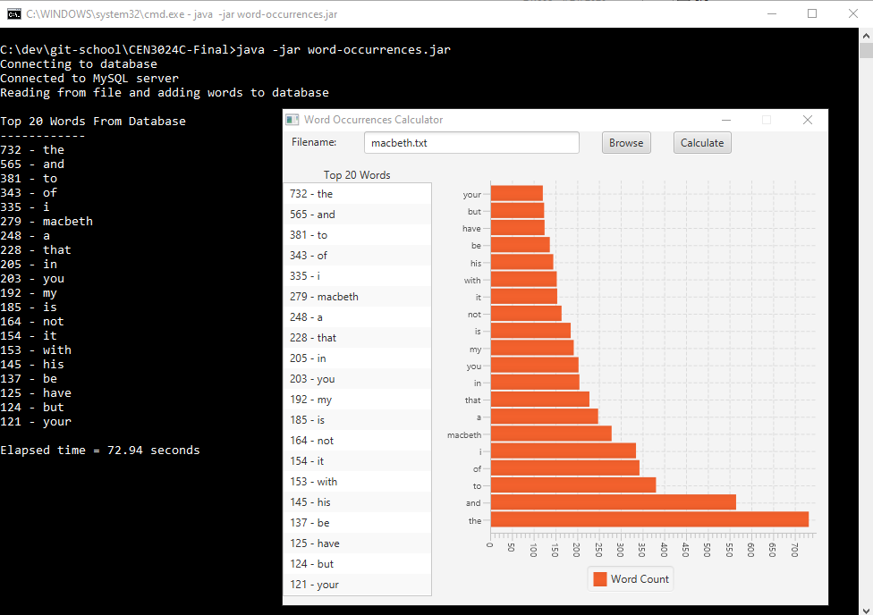

# CEN3024C-Final
My source code submission for final project

**Project criteria and specifications were as follows:**

This project covered the following topics
- Source control
- Documentation/JavaDoc
- Creating a UI
- Unit testing
- Databases
- Deployment

## Learning Outcomes
- Student will create software to solve basic business problems.
- Student will create a plan for developing a software solutions
- Student will test software for correctness and completeness.
- Student will document software solutions.

## Assignment Instructions
- Submit an URL for your GIT hub repository.
- Submit all code here.
- Submit screenshots of your program working.

### Screenshot

Running project from a JAR file (see WordOccurrencesDB.java for hard-coded database settings)

Application passing all JUnit tests
